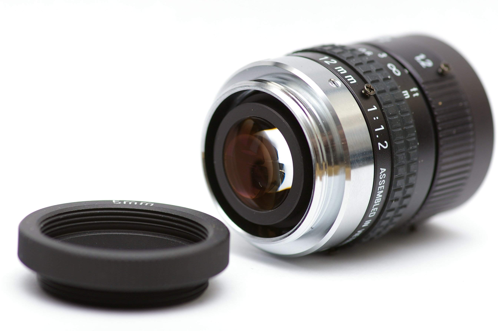

# C-mount

    
    

    12 mm f/1.2 C-mount lens [C-mount-to-CS-mount adapter] (출처: <a href="https://en.wikipedia.org/wiki/C_mount">[위키피디아] C mount</a>)
    

    
- Type: Screw 
- Flange 17.526 millimetres (0.6900 in)
    

  
> 사용처 예: 16 mm 영화용 카메라, CCTV, 머신 비전, 현미경 등
   
   
나사산은 일반적으로 1 인치의 지름(25.4mm)을 가지며, 인치당 32개의 나사산(0.794 mm pitch)이 있다.  
ANSI B1.1표준화 "1-32 UN 2A"
   
   
   

    
    

    플렌지의 초점 거리 개념 (출처: <a href="https://en.wikipedia.org/wiki/Flange_focal_distance">[위키피디아] Flange focal distance</a>)
    

플렌지의 초점 거리: 17.526 mm (0.6900 in)

일반적으로 C-mount 렌즈는 **8mm와 16mm 필름 형식**을 위해 만들어졌으며,  **`1/3", 1/2", 2/3", 1", 4/3"`** 비디오 형식을 위해 만들어졌다(이는 직경이 약 5~22mm인 이미지 서클 범위에 해당).

---

# CS mount
CS 마운트는 12.526 mm (0.4931 in)의 플렌지 초점 거리를 가지지만, 그외의 경우는 모두 C 마운트와 같다.
CS 마운트의 렌즈는 1/2 인치 이하의 더 작은 규격들을 위해 만들어진다.

Camera body | Extension tube adapter    | Lens  | Net effect    | Focus     | View angle    | Zoom      | Exposure
---|:---:|:---:|:---:|:---:|:---:|:---:|---:
C           |                           | C     |               | Normal    | Normal        | Normal    | Normal
C           |                           | CS    | +5 mm         | Near-sighted | Narrower   | Larger    | Darker
C           | 5.0 mm (0.20 in)          | C     | +5 mm         | Near-sighted | Narrower   | Larger    | Darker
C           | 5.0 mm (0.20 in)          | CS    | +10 mm        | Most near-sighted | Narrowest | Largest   | Darkest
CS          |                           | C     | -5 mm         | Far-sighted   | Wider     | Smaller   | Brighter
CS          |                           | CS    |               | Normal        | Normal    | Normal    | Normal
CS          | 5.0 mm (0.20 in)          | C     |               | Normal        | Normal    | Normal    | Normal
CS          | 5.0 mm (0.20 in)          | CS    | +5 mm         | Near-sighted  | Narrower  | Larger    | Darker
